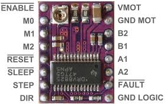

# First test of the motors

I wanted to test the motor sound and power usage.

Getting the current was a bit of a hassle, so I did one measurement.

Measuring from the adapter: 12.1V and 0.255A
This results in 3W!!

Thats a lot.

I tried the other tape motor and got 3V and 0.095A
Giving 0.3W

## NEMA specs

**Electrical Specification**
Manufacturer Part Number: 11HS04-0504S
Motor Type: Bipolar Stepper
Step Angle: 1.8deg
Holding Torque: 1Ncm(1.4164oz.in)
Rated Current/phase: 0.5A
Phase Resistance: 4ohms
Inductance: 0.8mH±20%(1KHz)
Insulation Class: B 130°C[266°F]

**Physical Specification**
Frame Size: 28 x 28mm
Body Length: 9.5mm
Shaft Diameter: Φ3mm
Shaft Length: 10mm
Number of Leads: 4
Lead Length: 300mm
Weight: 28g

**Connection**

|A+|A-|B+|B-|
|--|--|--|--|
|Red|Blue|Orange|Yellow|

